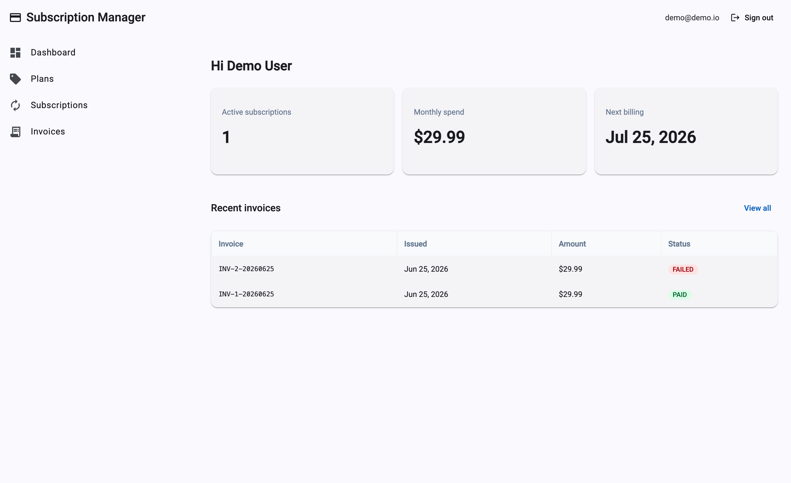
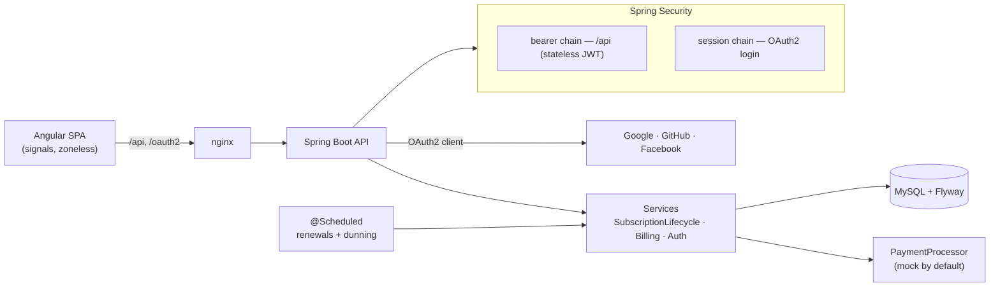
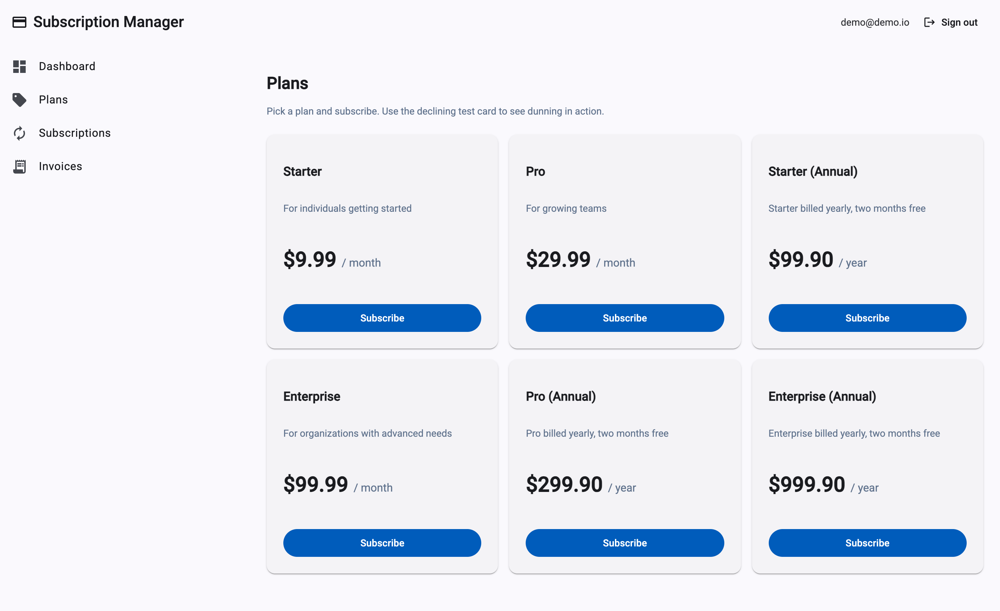
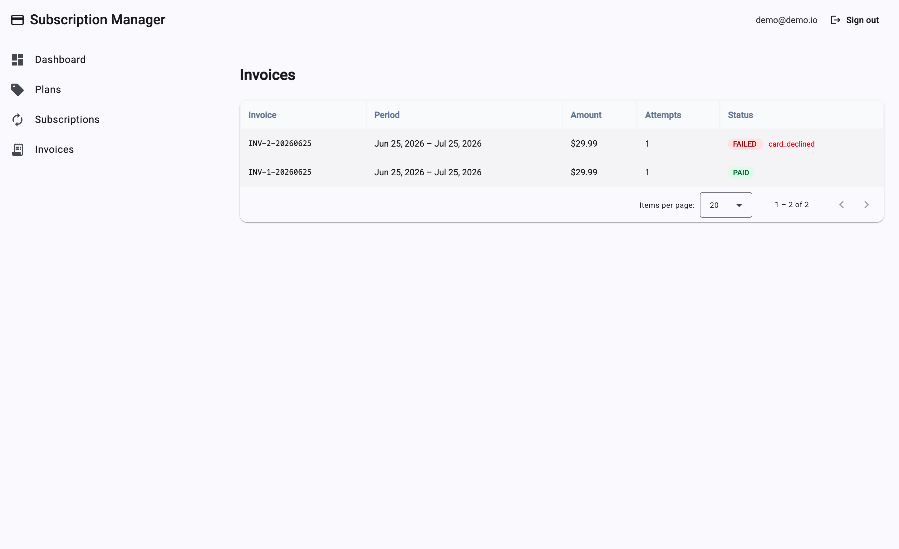

# Subscription Manager

A full-stack subscription and recurring-billing application: a Spring Boot API and an Angular SPA, with real authentication (local JWT plus Google / GitHub / Facebook social login) and an automated **dunning** engine that retries failed payments on a backoff schedule before cancelling.

[](https://github.com/rafaelinfante/subscription-manager/actions/workflows/ci.yml)
[](https://github.com/rafaelinfante/subscription-manager/actions/workflows/codeql.yml)
[](LICENSE)


I built this to show end-to-end delivery — from the Angular screen down to the MySQL schema — around a domain I work in every day: recurring payments and collections. The piece I care most about is the billing lifecycle: subscriptions renew on a schedule, failed charges fall into a dunning flow with retry backoff, and everything that happens is written to an append-only event log.



## What it does

- **Subscriptions** — subscribe to a plan (with an optional trial), upgrade or downgrade, and cancel immediately or at period end. Illegal state transitions are rejected in the service layer, not left to the database.
- **Recurring billing + dunning** — a scheduled job charges due subscriptions. A declined charge moves the subscription to `PAST_DUE` and schedules retries on a **1 / 3 / 5 day** backoff; after the retries are exhausted the subscription is cancelled. A later successful charge recovers it.
- **Authentication** — register and log in for a local account, or sign in with **Google, GitHub or Facebook**. Either way the backend issues its own RS256 JWT; a short-lived access token lives in memory in the SPA and a rotating refresh token rides in an HttpOnly cookie.
- **Invoices** — every charge produces an invoice you can page through, with its status and any failure reason.
- **Admin** — manage plans and trigger the billing cycle on demand (handy for demos).

## Architecture



The browser talks to a single origin (nginx), which proxies `/api` and `/oauth2` to the Spring Boot API. The API owns persistence (MySQL via Flyway), acts as the **OAuth2 client** to Google / GitHub / Facebook for social login, and charges through a `PaymentProcessor`; a scheduled job drives renewals and dunning.

**Backend** is layered: `domain` (JPA entities + the subscription state machine), `repository`, `service` (`SubscriptionLifecycleService`, `BillingService`, `AuthService`), `security` (two Spring Security filter chains — a stateless bearer chain for `/api` and a session chain that runs the OAuth2 login dance), and `web` (controllers, DTOs, an RFC 9457 error handler). The payment gateway sits behind a `PaymentProcessor` interface so the whole thing runs with a deterministic mock and no third-party keys.

**Frontend** is a standalone, zoneless Angular app: a signal-based auth store, functional HTTP interceptors (attach the bearer token, refresh once on a 401), route guards, and lazy-loaded feature pages built with Angular Material and Tailwind.

## Tech stack

| | |
|---|---|
| Backend | Java 21, Spring Boot 4.1, Spring Security 7, Spring Data JPA, MySQL 8, Flyway, springdoc OpenAPI |
| Frontend | Angular 21 (standalone, signals, zoneless), Angular Material, Tailwind CSS v4, RxJS |
| Build & test | Maven, JUnit 5, Mockito, Testcontainers, Vitest |
| Ops | Docker, Docker Compose, GitHub Actions, CodeQL, Dependabot |

## Run it

You need Docker. From the repo root:

```bash
docker compose up --build
```

That starts MySQL, the API, and the SPA behind nginx. When it's up:

- App: **http://localhost:8088**
- API docs (Swagger UI): **http://localhost:8080/swagger-ui.html**

The database is seeded with plans and two accounts so you can sign in straight away:

| Email | Password | Role |
|---|---|---|
| `demo@demo.io` | `Password123!` | user |
| `admin@demo.io` | `Password123!` | user + admin |

**Try the dunning flow:** subscribe to a plan and choose the *"Test card (always declines)"* payment method. The subscription lands in `PAST_DUE`. Open **Admin → Run billing now** a few times to walk it through the retries and watch it cancel, then look at the invoices. (The compose demo is configured to retry immediately so you can see the whole cycle; production uses the 1 / 3 / 5 day schedule.)

A quick API smoke test:

```bash
# log in and capture the access token
TOKEN=$(curl -s -X POST http://localhost:8080/api/auth/login \
  -H 'Content-Type: application/json' \
  -d '{"email":"demo@demo.io","password":"Password123!"}' | sed 's/.*"accessToken":"\([^"]*\)".*/\1/')

# list the seeded plans
curl -s http://localhost:8080/api/plans

# subscribe to plan 1
curl -s -X POST http://localhost:8080/api/subscriptions \
  -H "Authorization: Bearer $TOKEN" -H 'Content-Type: application/json' \
  -d '{"planId":1,"paymentMethodToken":"tok_visa","trial":false}'
```

## How auth works

- **Local**: `POST /api/auth/register` / `login` return an access token in the body and set a refresh-token cookie. The access token is sent as a bearer header; on a `401` the SPA calls `POST /api/auth/refresh` (using the cookie) once, gets a fresh token, and replays the request.
- **Social**: the social buttons send the browser to `/oauth2/authorization/{provider}`. Spring acts as the OAuth2 client, links or creates the local account, mints the same kind of app JWT, sets the refresh cookie, and redirects back to the SPA — which exchanges the cookie for an access token.
- Refresh tokens are tracked server-side, so they rotate on every use and are revoked on logout.
- Repeated failed logins are rate-limited with a short lockout, to blunt brute-force and credential-stuffing attempts.

Social login is **off until you configure a provider** — the app boots and runs fully on local accounts with no keys. To enable a provider, set its client id/secret (see [`.env.example`](.env.example)); the registered redirect URI is `http://localhost:8080/login/oauth2/code/{provider}`.

## Local development

Run the two halves separately for fast feedback:

```bash
# API (needs a MySQL on localhost:3306, or just use `docker compose up mysql`)
cd backend && ./mvnw spring-boot:run

# SPA — proxies /api and /oauth2 to the API on :8080
cd frontend && npm install && npm start   # http://localhost:4200
```

## Testing

```bash
cd backend  && ./mvnw verify   # unit tests + Testcontainers integration tests
cd frontend && npm test        # Vitest
```

The backend integration tests spin up a real MySQL with Testcontainers and cover registration/login/refresh, the subscription API, and the full dunning path (renewal, retry backoff, cancellation after exhausted retries, and recovery).

## Screens

| Plans | Invoices |
|---|---|
|  |  |

## Roadmap

- A real Stripe test-mode `PaymentProcessor` behind the existing interface
- Proration on mid-period plan changes
- Email/SMS dunning notifications
- A JWKS endpoint and key rotation for the JWTs
- Distributed, IP-aware login rate limiting (the current lockout is in-memory and keyed on email)
- Prometheus/Grafana dashboards (the API already exposes `/actuator/prometheus`)
